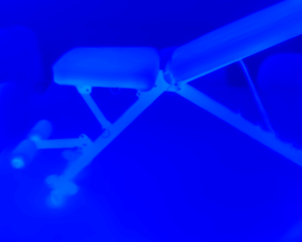
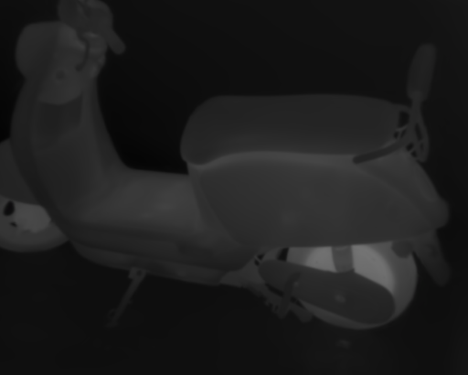
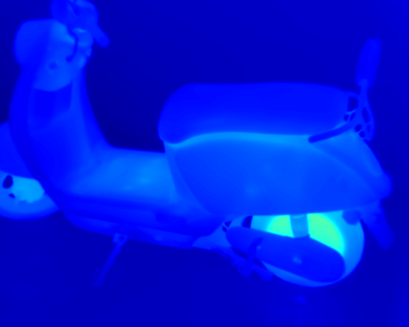
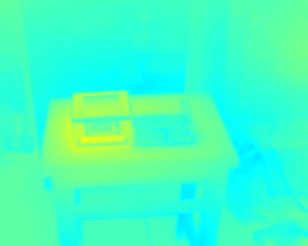
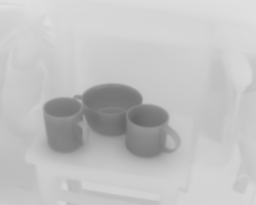
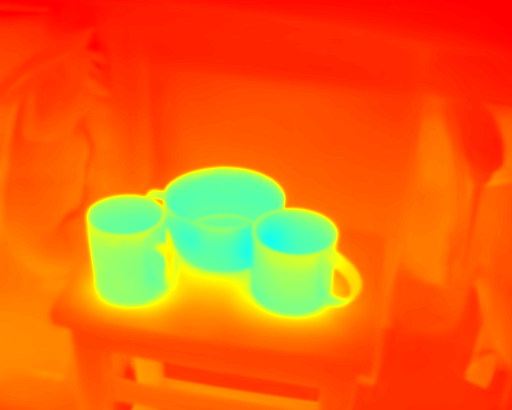

# Temporal PhysIR-Splat

This repository contains the temporal branch of **PhysIR-Splat: Physically Consistent Thermal Infrared Radiative Transfer in 3D Gaussian Splatting**.

Temporal PhysIR-Splat targets dynamic thermal infrared novel-view synthesis. It extends PhysIR-Splat from static thermal scenes to time-varying thermal processes by assigning Gaussian primitives physically interpretable temperature and emissivity attributes, then modeling temperature evolution over continuous timestamps.

## Method Overview

Temporal PhysIR-Splat represents thermal infrared image formation with Gaussian primitives carrying temperature, effective in-band emissivity, and opacity. During rendering, the temporal thermal state modulates the infrared radiance of each Gaussian. The temporal branch uses learnable basis coefficients to evaluate Gaussian temperature at arbitrary timestamps without numerical ODE integration.

## RHD Examples

Each example shows a grayscale rendering and the corresponding RHD-style pseudo-color visualization.

<table>
<tr>
<td width="50%"> <br><sub>cooling_bench / gray and pseudo-color</sub></td>
<td width="50%"> <br><sub>cooling_ebike / gray and pseudo-color</sub></td>
</tr>
<tr>
<td width="50%"> <br><sub>heat_transfer / gray and pseudo-color</sub></td>
<td width="50%"> <br><sub>warming_cups / gray and pseudo-color</sub></td>
</tr>
</table>

## Dataset

RHD scenes are expected to be arranged as COLMAP-style thermal folders:

```text
dataset/RHD/
  cooling_bench/
    thermal/
      images/
      sparse/0/
      info.json
  ...
```

With `--eval`, the thermal split is created by holding out centered temporal segments from each quarter of the sequence, matching the current code path.

## Environment

```bash
conda env create -f environment.yml
conda activate thermal3dgs
```

If you already have a compatible PyTorch/CUDA environment, install only the missing packages and build the Gaussian rasterization submodules as usual.

## Training

Train one scene:

```bash
python train.py -s dataset/RHD/cooling_bench/thermal -m output/RHD_temporal_physir_splat/cooling_bench --eval
```

Run the RHD thermal split:

```bash
bash scripts/run_rhd_temporal_physir.sh
```

## Rendering And Evaluation

```bash
python render.py -m output/RHD_temporal_physir_splat/cooling_bench --iteration 30000 --skip_train
python metrics.py -m output/RHD_temporal_physir_splat/cooling_bench
```

The batch script trains, renders, evaluates, and writes a CSV summary:

```text
output/RHD_temporal_physir_splat/metrics_summary.csv
```

## Acknowledgements

This codebase builds on 3D Gaussian Splatting infrastructure and is inspired by recent thermal 3DGS work. We thank the authors of:

```bibtex
@article{wang2026etgs,
  title={ETGS: Explicit Thermodynamics Gaussian Splatting for Dynamic Thermal Reconstruction},
  author={Wang, Zhongwen and Ling, Han and Zhang, Weihao and Sun, Yinghui and Sun, Quansen},
  journal={International Conference on Learning Representations},
  year={2026}
}

@inproceedings{luthermalgaussian,
  title={ThermalGaussian: Thermal 3D Gaussian Splatting},
  author={Lu, Rongfeng and Chen, Hangyu and Zhu, Zunjie and Qin, Yuhang and Lu, Ming and Yan, Chenggang and others},
  booktitle={International Conference on Learning Representations},
  year={2025}
}

@inproceedings{chen2024thermal3d,
  title={Thermal3D-GS: Physics-Induced 3D Gaussians for Thermal Infrared Novel-View Synthesis},
  author={Chen, Qian and Shu, Shihao and Bai, Xiangzhi},
  booktitle={European Conference on Computer Vision},
  pages={253--269},
  year={2024}
}

@article{chen2026thermal3dpami,
  title={Thermal3D-GS: Physics-Induced 3D Gaussians for Thermal Infrared Novel-View Synthesis With a Large-Scale Dataset},
  author={Chen, Qian and Shu, Shihao and Sun, Heng and Chen, Junzhang and Bai, Xiangzhi},
  journal={IEEE Transactions on Pattern Analysis and Machine Intelligence},
  volume={48},
  number={6},
  pages={6962--6979},
  year={2026},
  doi={10.1109/TPAMI.2026.3663966}
}

@inproceedings{nam2025veta,
  title={Veta-GS: View-Dependent Deformable 3D Gaussian Splatting for Thermal Infrared Novel-View Synthesis},
  author={Nam, Myeongseok and Park, Wongi and Kim, Minsol and Hur, Hyejin and Lee, Soomok},
  booktitle={IEEE International Conference on Image Processing},
  pages={965--970},
  year={2025}
}

@article{kerbl2023gaussians,
  title={3D Gaussian Splatting for Real-Time Radiance Field Rendering},
  author={Kerbl, Bernhard and Kopanas, Georgios and Leimkuehler, Thomas and Drettakis, George},
  journal={ACM Transactions on Graphics},
  volume={42},
  number={4},
  year={2023}
}
```

## License

This repository contains components derived from third-party research code. Keep the accompanying license files and source notices when redistributing or publishing modified versions.

## Citation

If you find this repository useful, please cite PhysIR-Splat:

```bibtex
@inproceedings{gao2026physirsplat,
  title={PhysIR-Splat: Physically Consistent Thermal Infrared Radiative Transfer in 3D Gaussian Splatting},
  author={Gao, Jingyuan and Zhang, Qiming and Gao, Fei and Zhang, Mingjin},
  booktitle={IEEE/CVF Conference on Computer Vision and Pattern Recognition},
  year={2026}
}
```
